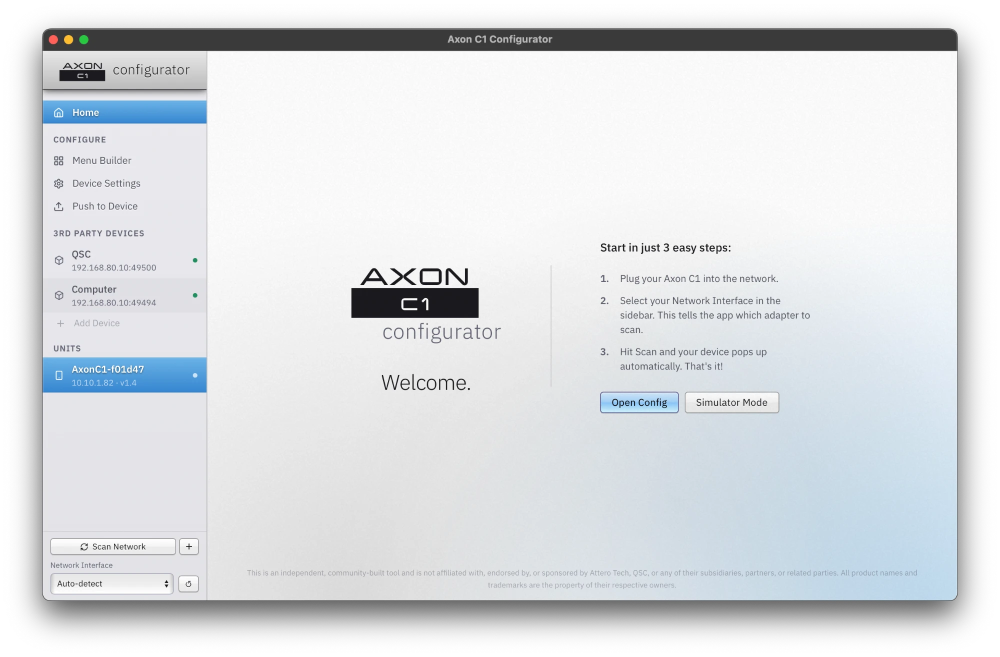
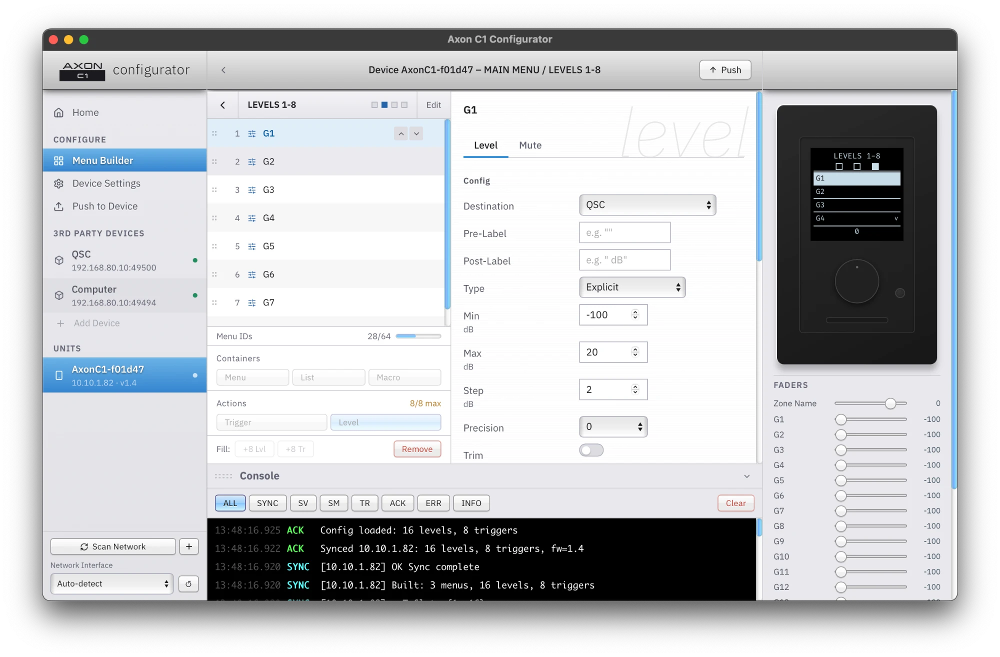

# Axon C1 Configurator

Web-based configurator for the Attero Tech Axon C1 (by QSC / Attero Tech), built from complete reverse engineering of the UDP control protocol and the `AxonC1_plugin.dll`.

<table><tr>
<td></td>
<td></td>
</tr></table>

## Architecture

```
Native Window (PyWebView)
        |
Browser (React/Vite) <--HTTP/WS--> Python/aiohttp <--UDP 49494/49500--> Axon C1
```

- **Port 49494**: Bidirectional config/command channel (QUERY, SLC, GMIID, config push...)
- **Port 49500**: Async runtime channel (C1 sends SV/SM/TR; host replies to SV polls)
- **WebSocket /ws/{ip}**: Streams all device events to the browser in real time
- **Discovery**: mDNS `_attero-ad._udp.local.` + UDP broadcast scan on :49494

---

## Running the app

### macOS

Requires Python 3.9+ and Node.js 18+.

```bash
./run.sh
```

Builds the frontend, installs backend dependencies, and opens a native window.

### Windows

Requires Python 3.9+ and Node.js 18+ on your PATH.

```cmd
run.bat
```

---

## Development (hot-reload)

Run the backend and Vite dev server separately:

```bash
# Terminal 1
cd backend
pip install -r requirements.txt
python server.py

# Terminal 2
cd frontend
npm install
npm run dev
# Opens http://localhost:5173 -- API/WS proxied to backend on :8080
```

---

## Device Overview

| Field | Value |
|-------|-------|
| Model | Attero Tech Axon C1 |
| Part number | 900-00223-01 |
| Display | 1.5" OLED |
| Controls | Rotary encoder + pushbutton, menu/toggle button |
| Network | 100Mbps Ethernet, PoE 802.3af Class 0 |
| Control transport | UDP only port 49494. TCP not supported. |
| Packet terminator | `\r` (CR only, no LF) |

---

## Protocol

### Discovery

- mDNS service: `_attero-ad._udp.local.` (NOT `_attero._udp.local.`)
- Device name is the first label of the mDNS service name: `Hello._attero-ad._udp.local.` → `Hello`
- Device name is **only available via mDNS**. It does not appear in `QUERY` or any UDP command. `SDN` sets it; there is no getter.
- `Menu=` TXT field contains the current menu hash (MD5); `"NONE"` if no menu is pushed.
- Broadcast QUERY to 255.255.255.255:49494 also discovers devices but does not return a name.

### ASCII Commands

All commands are plain ASCII terminated with `\r`. Device responds `ACK <COMMAND> [value]\r`.

| Command | Format | Description |
|---------|--------|-------------|
| `QUERY` | `QUERY\r` | Get all device settings |
| `GMID` | `GMID\r` | Get current menu hash (32-char hex) |
| `GMIID` | `GMIID\r` | Get all menu item IDs |
| `GMI` | `GMI 0xHHHH\r` | Get menu item by ID |
| `GLI` | `GLI 0xHHHH V\r` / `GLI 0xHHHH M\r` | Get level info (vol/mute) |
| `SCM` | `SCM THIRD_PARTY\r` / `SCM Q-SYS\r` | Set control mode |
| `SDN` | `SDN name\r` | Set device name (max 16 chars, no spaces) |
| `SMID` | `SMID <32hexchars>\r` | Set menu hash (device stores whatever is sent) |
| `SDB` | `SDB N\r` | Set display brightness (1–10) |
| `SDT` | `SDT N\r` | Set display timeout (10–600 sec) |
| `SDL` | `SDL N\r` | Set display level value enable (0/1) |
| `SDR` | `SDR N\r` | Set display rotation (0/1) |
| `SLBB` | `SLBB N\r` | Set lightbar brightness (1–10) |
| `SLPM` | `SLPM N\r` | Set lock/PIN mode (0/1) |
| `SLP` | `SLP NNNN\r` | Set lock PIN only send when SLPM=1 |
| `SSIPC` | `SSIPC ip netmask 0.0.0.0\r` | Set static IP (all zeros = DHCP) |
| `SF` | `SF 1\r` | Commit menu transaction (plain ASCII, not JSON) |
| `DEFAULTS` | `DEFAULTS\r` | Factory reset (destructive) |

### QUERY Response

```
ACK QUERY MAC=0xXXXXXXXXXXXX ID=0 CM=THIRD_PARTY IP=0.0.0.0 SNM=0.0.0.0 GW=0.0.0.0
          LBB=5 LBT=10 DB=10 DT=10 LPM=0 LP=0000 DL=0
          QSYSIP=0.0.0.0 QSYSPORT=0 LC=OFF
```

---

## Menu Push Protocol

### Packet Types

| Prefix | Name | Purpose |
|--------|------|---------|
| `MT` | Menu Table | Declares all menu item IDs (max 64 total) |
| `MI` | Menu Item | Defines menu structure entries |
| `AI` | Action Item | Defines action payloads or macro commands |
| `CI` | Control Item | Defines vol/mute control config |
| `CQ` | Control Query | Defines polling config |
| `CA` | Control Async | Defines async monitoring config (NOT sent on wire; included in hash only) |
| `DL` | Device List | Pushes 3rd party device list (max 3 entries) |
| `SF` | Save/Finalize | Commits the menu transaction (plain ASCII) |

### Push Sequence

```
1.  SCM THIRD_PARTY  (twice required for menu to persist)
    SDB / SDL / SDT / SDR / SLBB / SLBT / SLPM / SLP (settings block)

2.  MT{...}          announce all IDs

3.  DL{...}          3rd party device list (sent second on wire despite highest jsonId)

4.  MI{...}          deepest leaf items first, root/system entries last
                       all siblings with same parent in ONE packet

5.  AI{...}          macro (m_action) packets first, then action packets

6.  CI / CQ          vol before mute per item, descending ID order (highest child first, 0xFFFE last)
                       sync CI/CQ after all vol/mute pairs

7.  SF 1\r           commit
```

### SMID Hash

The device does **not** compute the hash it stores whatever 32-char hex is sent via `SMID`. The configurator must compute and send it after `SF`.

```
SMID = MD5( MT + DL + MI... + AI... + CI... + CQ... + CA... + b"SF 1\r" )
```

All packets concatenated in wire-send order as raw bytes (`2-char prefix + compact JSON`). CA packets are **not sent on wire** but are included in the hash. `SF 1\r` appended as a literal suffix.

Verified hash `daeb99ea82e63f960e1c41777aaa6b63` accepted by device with no Menu Hash Error in Unify.

### jsonId Assignment

jsonIds are pre-computed before any packets are sent, in this order:

| Position | Type | jsonId |
|----------|------|--------|
| 1 | MT | 1 |
| 2 | MI root system block | 2 |
| 3..N | MI leaf/submenu packets | 3, 4, 5... |
| N+1.. | AI packets | sequential |
| .. | CI / CQ / CA pairs | sequential |
| total | DL | highest (total packet count) |

### Result Codes

After `SF`, the device sends a result JSON with `json_ids` and `result_ids` arrays. All zeros = success.

| Code | Meaning |
|------|---------|
| 0 | Success |
| 2 | MI label (`txt`) exceeds 16 characters |
| 4 | MT rejected (exact trigger unknown) |
| 11 | MI `first` field does not match actual first entry ID |
| 15 | Stale session bleed (duplicate jsonId=1 from prior session not a real error) |
| 17 | AI action `bytes` payload too large (limit 64 bytes) |
| 19 | DL entry count exceeded |
| 109 | lvlPreStr or lvlPostStr too long (limit 7 chars confirmed on hardware) |
| 118 | CI references overflowed DL entry |
| 208 | Sync CQ: `dev` name not found in DL |
| 308 | Sync CA: `dev` name not found in DL |

---

## Device Limits

| Limit | Value |
|-------|-------|
| MT IDs (total) | 64 (4 system + 60 menu); silent truncation above 64 |
| MI label (`txt`) | 16 chars |
| AI action payload | 64 bytes |
| DL device entries | 3 max |
| lvlPreStr / lvlPostStr | 7 chars each |
| Menu depth | 4 levels (D1–D4) |
| Children per menu | 8 |
| Device name | 16 chars, no spaces |
| Lightbar brightness | 1–10 (minimum 1, not 0) |

---

## ID Scheme

```
D1 submenus:  0xFFF_   _ = submenu index (0-7)
D2 items:     0xFF__   low nibble = D1 index, high nibble of low byte = position
D3 items:     0xF___   low byte = D2 low byte, high nibble = position
D4 items:     0x____   low 12 bits = D3 low 12 bits, high nibble = position
```

### System IDs

| ID | Hex | Purpose |
|----|-----|---------|
| `ID_TOP_MENU` | 0xFFFF | Top menu container (name = main menu name) |
| `ID_ROOT_CTRL` | 0xFFFE | Root vol/mute ctrl (vol/mute screen) |
| `ID_INIT_MACRO` | 0xFFFB | Init macro item |
| `ID_SYNC` | 0xFFFD | Startup sync item |

D1 submenu containers (0xFFF0–0xFFF7) are **type=0 (MENU)**, not type=3. Only leaf controls (volume/mute faders) are type=3.

---

## Protocol Notes

- `SCM THIRD_PARTY` must be sent **twice** before MT for the menu to persist to GMIID.
- `SLP` must only be sent when `SLPM=1`. Sending it when lock is off causes the device to not ACK `SLPM 0`.
- Vol CI must be sent before mute CI for each item.
- `SDL` (display lock) is a stub on firmware 1.5 and does not persist.
- Safe SV channel range when interoperating with unIFY DLL: 1–9 (8-byte cmdMask bug in DLL; firmware has no such limit).
- Lightbar color resets after ~5s; use SLC on a timer to maintain it.
- Always create a fresh UDP socket per push (cfgUDP cannot be reopened).
- The C1 sends runtime SV/SM/TR to the IP:port set in the last DL packet, not broadcast.
- A failed SF leaves the device in a dirty transaction state. Send a fresh MT + SF to clear before retrying.
- The SF result JSON may contain a duplicate `jsonId=1` at the end (stale bleed from the previous session). Skip duplicate jsonId entries when parsing.

---

## LED Status

| LED State | Condition |
|-----------|-----------|
| Slow flashing white | Identify active |
| Green | Audio level > -40 and < -20 dBFS |
| Yellow | Audio level ≥ -20 and < 3 dBFS |
| Red | Audio level ≥ 3 dBFS |
| Blue | Mute active |
| Flashing blue | Firmware update in progress |
| Steady white | Main menu active |
| Quick flashing white | Menu selection executed |

## Physical Controls

- **Encoder rotate**: Value up/down
- **Encoder press**: Select
- **Menu button press**: Menu/Toggle
- **Menu button hold 1s**: Device info screen (IP, mode, MAC, name, firmware)
- **Encoder + Menu hold 5s**: Factory reset (PIN required if locked)
